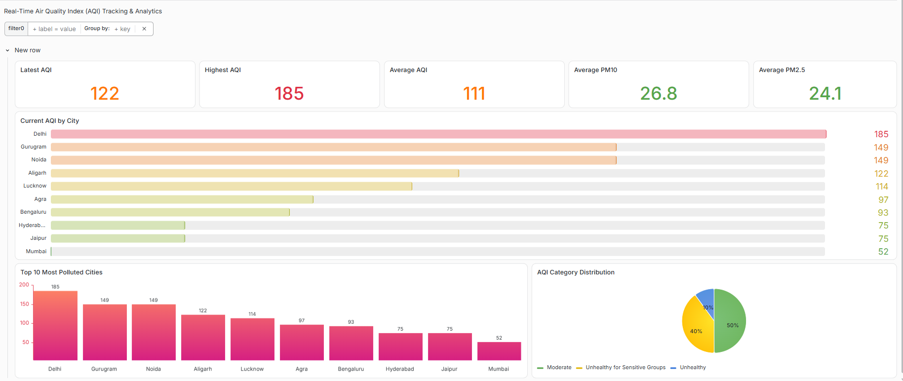
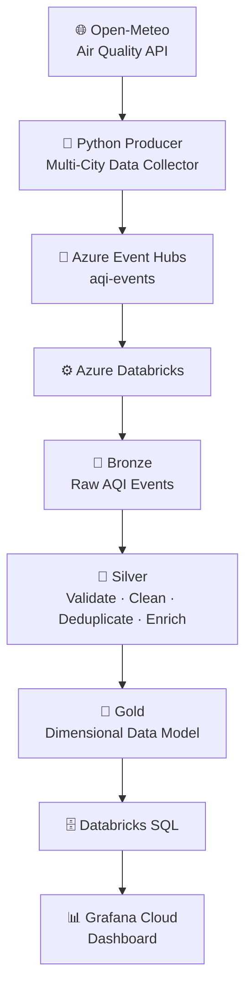
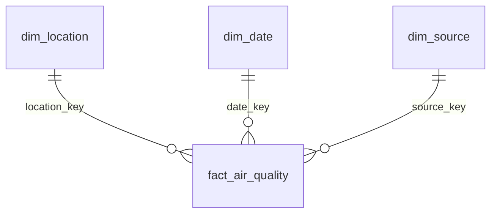
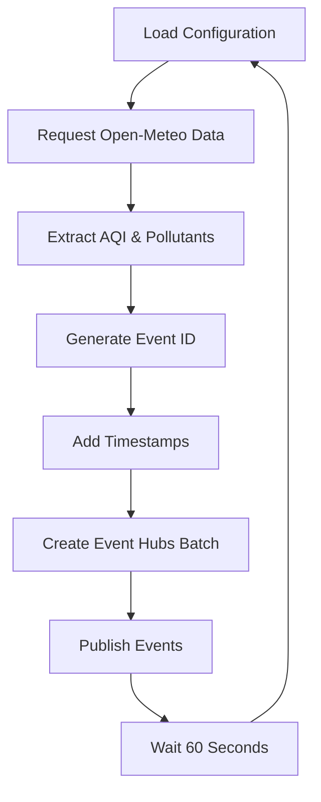

# 🌍 Real-Time Air Quality Index (AQI) Tracking & Analytics Platform

<p align="center">
  
  
  
  
  
</p>

<p align="center">
  <b>An end-to-end real-time data engineering platform for collecting, streaming, transforming, and analyzing air-quality data across major Indian cities.</b>
</p>

<p align="center">
  Built with <b>Python · Open-Meteo · Azure Event Hubs · Azure Databricks · Delta Lake · Unity Catalog · Databricks SQL · Grafana Cloud</b>
</p>

The platform continuously ingests air-quality events, processes them through a **Bronze → Silver → Gold Medallion Architecture**, and exposes analytics-ready data through an interactive Grafana dashboard.

---

## 📑 Table of Contents

- [Dashboard Preview](#-dashboard-preview)
- [Architecture](#️-architecture)
- [Project Objectives](#-project-objectives)
- [Key Features](#-key-features)
- [Cities Monitored](#-cities-monitored)
- [Technology Stack](#️-technology-stack)
- [Medallion Architecture](#-medallion-architecture)
- [Processing Pipeline](#-processing-pipeline)
- [Databricks Notebooks](#-databricks-notebooks)
- [SQL Layer](#️-sql-layer)
- [Python Producer](#-python-producer)
- [Event Schema](#-event-schema)
- [Grafana Dashboard](#-grafana-dashboard)
- [Example Analytics Queries](#-example-analytics-queries)
- [Data Validation](#-data-validation)
- [Project Structure](#-project-structure)
- [Security](#-security)
- [Local Setup](#️-local-setup)
- [Azure Resources](#️-azure-resources)
- [Engineering Challenges Solved](#-engineering-challenges-solved)
- [Business & Analytical Use Cases](#-business--analytical-use-cases)
- [Future Enhancements](#-future-enhancements)
- [Author](#-author)
- [Project Status](#-project-status)

---

## 📊 Dashboard Preview

<p align="center">
  
</p>

> Real-time dashboard showing AQI, PM2.5, PM10, city-level pollution rankings, AQI trends, and AQI category distribution.

---

## 🏗️ Architecture


### End-to-End Data Flow



---

## 🎯 Project Objectives

This project was designed to demonstrate a production-style data engineering workflow involving:

- Real-time event ingestion
- Cloud-based streaming architecture
- Structured data processing
- Medallion architecture
- Delta Lake
- Data-quality validation
- Dimensional data modeling
- Automated data transformation
- Analytical SQL
- Real-time dashboarding
- Secure credential management

---

## 🚀 Key Features

| | | |
|---|---|---|
| **⚡ Real-Time Ingestion** | A Python producer continuously retrieves air-quality measurements from Open-Meteo and publishes events to Azure Event Hubs. ||
| **📡 Event-Driven Streaming** | Azure Event Hubs acts as the real-time messaging layer between the data producer and Databricks. ||
| **🧱 Medallion Architecture** | Data moves through three logical processing layers: **Bronze → Silver → Gold**. ||
| **🧹 Data Quality & Transformation** | The Silver layer validates, cleans, deduplicates, and enriches incoming events. ||
| **⭐ Analytics-Ready Gold Layer** | The Gold layer implements a dimensional model optimized for analytical workloads. ||
| **📊 Real-Time Dashboard** | Grafana Cloud provides interactive monitoring of AQI and pollutant metrics. ||
| **🔐 Secure Configuration** | Credentials are excluded from source control and handled through environment variables and Databricks Secret Scope. ||

---

## 🌆 Cities Monitored

The current implementation monitors **10 Indian cities**:

| City | Latitude | Longitude |
|---|---:|---:|
| Delhi | 28.6139 | 77.2090 |
| Noida | 28.5355 | 77.3910 |
| Gurugram | 28.4595 | 77.0266 |
| Lucknow | 26.8467 | 80.9462 |
| Agra | 27.1767 | 78.0081 |
| Jaipur | 26.9124 | 75.7873 |
| Mumbai | 19.0760 | 72.8777 |
| Hyderabad | 17.3850 | 78.4867 |
| Bengaluru | 12.9716 | 77.5946 |
| Aligarh | 27.8974 | 78.0880 |

The producer publishes a new AQI event for each configured city approximately every **60 seconds**.

---

## 🛠️ Technology Stack

| Category | Technology |
|---|---|
| Data Source | Open-Meteo Air Quality API |
| Programming | Python |
| Event Streaming | Azure Event Hubs |
| Processing | Azure Databricks |
| Streaming Engine | Databricks Structured Streaming |
| Storage Format | Delta Lake |
| Cloud Storage | Azure Data Lake Storage Gen2 |
| Governance | Unity Catalog |
| Data Modeling | Star Schema |
| Query Engine | Databricks SQL |
| Visualization | Grafana Cloud |
| Version Control | Git & GitHub |

---

## 🧱 Medallion Architecture

### 🥉 Bronze — Raw Ingestion

The Bronze layer receives events directly from Azure Event Hubs.

**Table:** `aqi_platform.bronze.aqi_events`

**Responsibilities**
- Consume Event Hubs events
- Parse incoming JSON
- Apply the defined event schema
- Preserve source measurements
- Add ingestion timestamps
- Store events as Delta data

The Bronze layer is designed to retain the original event-level information before business transformations are applied.

### 🥈 Silver — Validated & Enriched Data

The Silver layer processes Bronze records into clean analytical records.

**Table:** `aqi_platform.silver.aqi_events`

**Transformations**
- Required-field validation
- AQI category classification
- Duplicate event removal
- Watermark-based streaming handling
- Data-quality filtering
- Structured schema enforcement

**AQI Classification**

| AQI Range | Category |
|---:|---|
| 0–50 | 🟢 Good |
| 51–100 | 🟡 Moderate |
| 101–150 | 🟠 Unhealthy for Sensitive Groups |
| 151–200 | 🔴 Unhealthy |
| 201–300 | 🟣 Very Unhealthy |
| 301+ | 🟤 Hazardous |

### 🥇 Gold — Analytics Layer

The Gold layer provides a dimensional model for analytical queries and dashboard consumption.

**Dimension Tables:** `gold.dim_location` · `gold.dim_date` · `gold.dim_source`

**Fact Table:** `gold.fact_air_quality`



The fact table stores AQI and pollutant measurements together with dimension keys for efficient analytical queries.

---

## 🔄 Processing Pipeline

The production workflow is divided into independent, scheduled processing stages:

```mermaid
flowchart LR
    A["Open-Meteo API"] --> B["Python Producer"]
    B --> C["Azure Event Hubs"]
    C --> D["01_eventhub_ingestion.py"]
    D --> E["Bronze Delta Table"]
    E --> F["02_silver_transformation.py"]
    F --> G["Silver Delta Table"]
    G --> H["03_gold_transformation.py"]
    H --> I["Gold Star Schema"]
    I --> J["Databricks SQL"]
    J --> K["Grafana Cloud"]
```



The Silver and Gold transformation jobs are scheduled at **one-minute intervals**, allowing newly arriving records to move through the analytical layers with low latency.

---

## 📓 Databricks Notebooks

<details>
<summary><code>01_eventhub_ingestion.py</code></summary>
<br>

Responsible for:
- Connecting to Azure Event Hubs
- Consuming Kafka-compatible Event Hubs messages
- Parsing JSON payloads
- Applying the AQI event schema
- Writing events into Bronze Delta

</details>

<details>
<summary><code>02_silver_transformation.py</code></summary>
<br>

Responsible for:
- Reading Bronze streaming data
- Applying validation rules
- Classifying AQI categories
- Removing duplicate events
- Writing validated records to Silver

</details>

<details>
<summary><code>03_gold_transformation.py</code></summary>
<br>

Responsible for:
- Building dimension records
- Maintaining location, date, and source dimensions
- Resolving dimension keys
- Loading the AQI fact table
- Maintaining an analytics-ready Gold layer

</details>

---

## 🗄️ SQL Layer

```text
Databricks/SQL/
│
├── 01_setup.sql
├── 02_bronze.sql
├── 03_silver.sql
├── 04_gold.sql
└── 05_validation.sql
```

| Script | Purpose |
|---|---|
| `01_setup.sql` | Catalog, schemas and volumes |
| `02_bronze.sql` | Bronze table definitions |
| `03_silver.sql` | Silver validation and transformation logic |
| `04_gold.sql` | Gold dimensions and fact table |
| `05_validation.sql` | Data-quality and integrity checks |

---

## 🐍 Python Producer

The producer uses the Open-Meteo Air Quality API to retrieve current measurements for the configured cities.



**Measurements Collected**
- US AQI
- PM2.5
- PM10
- Carbon Monoxide
- Nitrogen Dioxide
- Sulphur Dioxide
- Ozone

---

## 📦 Event Schema

Example event:

```json
{
  "event_id": "uuid",
  "city": "Aligarh",
  "latitude": 27.8974,
  "longitude": 78.088,
  "timestamp_utc": "2026-09-15T10:24:34.449+00:00",
  "timestamp_ist": "2026-09-15T10:24:34.449+00:00",
  "api_timestamp_utc": "2026-09-15T10:00:00.000+00:00",
  "us_aqi": 91,
  "pm2_5": 25.3,
  "pm10": 26.5,
  "carbon_monoxide": 201.0,
  "nitrogen_dioxide": 2.4,
  "sulphur_dioxide": 10.0,
  "ozone": 145.0,
  "source": "open-meteo"
}
```

---

## 📊 Grafana Dashboard

The Gold layer is connected to Grafana Cloud through Databricks SQL.

**KPI Monitoring**
- Average AQI
- Highest AQI
- Average PM2.5
- Average PM10

**Real-Time Analysis**
- Current AQI by city
- AQI trend over the last hour
- Most polluted cities
- AQI category distribution

**Filtering**

A city-level filter allows users to analyze individual locations.


---

## 🧪 Data Validation

The project includes dedicated validation SQL covering:

- Bronze/Silver/Gold record counts
- Dimension record counts
- AQI category distribution
- Null foreign-key checks
- Duplicate event detection
- Orphan dimension detection
- Latest event verification
- City-level AQI analysis

Validation script: [`Databricks/SQL/05_validation.sql`](Databricks/SQL/05_validation.sql)

---

## 📁 Project Structure

```text
Real-Time (AQI) Tracking & Analytics Platform/
│
├── README.md
├── .gitignore
├── producer.py
│
├── Architecture/
│   └── architecture.png
│
├── Dashboard/
│   └── dashboard.png
│
├── Databricks/
│   │
│   ├── Notebooks/
│   │   ├── 01_eventhub_ingestion.py
│   │   ├── 02_silver_transformation.py
│   │   └── 03_gold_transformation.py
│   │
│   └── SQL/
│       ├── 01_setup.sql
│       ├── 02_bronze.sql
│       ├── 03_silver.sql
│       ├── 04_gold.sql
│       └── 05_validation.sql
│
└── docs/
    └── screenshots/
        └── grafana-dashboard.png
```

---

## 🔐 Security

No credentials are stored in the repository.

Sensitive configuration is handled using:
- Local `.env` configuration
- Databricks Secret Scope
- `.gitignore`
- Azure authentication and access policies

The following must **never** be committed:

```text
.env
connection strings
SharedAccessKey values
Azure storage account keys
PAT tokens
passwords
API secrets
```

---

## ⚙️ Local Setup

**1. Clone the Repository**

```bash
git clone https://github.com/alignasirkhan/Data-Engineering-Projects.git
```

**2. Navigate to the Project**

```bash
cd "Data-Engineering-Projects/Real-Time (AQI) Tracking & Analytics Platform"
```

**3. Create Environment Configuration**

Create a local `.env` file:

```env
EVENT_HUB_CONNECTION_STRING=<your-producer-connection-string>
EVENT_HUB_NAME=aqi-events
```

> Keep `.env` local. It is intentionally excluded from Git.

**4. Install Dependencies**

Install the Python dependencies required by `producer.py`.

**5. Start the Producer**

```bash
python producer.py
```

The producer will begin publishing AQI events to Azure Event Hubs.

**6. Configure Databricks**

Upload the notebooks and SQL scripts from `Databricks/`, then configure the required Event Hubs consumer credentials through Databricks Secret Scope.

---

## ☁️ Azure Resources

```text
Azure Resource Group
        │
        ├── Azure Event Hubs
        │      └── aqi-events
        │
        ├── Azure Databricks
        │
        ├── ADLS Gen2
        │
        └── Unity Catalog
```

Grafana Cloud provides the visualization layer on top of the analytical Gold data.

---

## 💡 Engineering Challenges Solved

| Challenge | Solution |
|---|---|
| **Event Hubs Authentication** | Separate Event Hubs policies are used for producer and consumer responsibilities, following least-privilege access. |
| **Streaming Connectivity** | The Databricks ingestion layer uses the Event Hubs Kafka-compatible endpoint with SASL/SSL authentication. |
| **Duplicate Events** | Event IDs and streaming deduplication are used to prevent duplicate analytical records. |
| **Dimension Management** | The Gold transformation dynamically maintains location, date, and source dimensions before loading fact records. |
| **Incremental Processing** | Silver and Gold transformations use incremental `AvailableNow` processing rather than repeatedly rebuilding the complete dataset. |
| **Credential Protection** | Secrets are kept outside the repository and retrieved through environment configuration and Databricks Secret Scope. |

---

## 📈 Business & Analytical Use Cases

- Real-time pollution monitoring
- City-level AQI comparison
- Pollution hotspot identification
- PM2.5 and PM10 monitoring
- Historical AQI analysis
- Environmental dashboards
- Data-quality monitoring
- Automated analytical pipelines

---

## 🚀 Future Enhancements

- [ ] Apache Kafka integration
- [ ] Azure Stream Analytics
- [ ] Machine-learning-based AQI forecasting
- [ ] 7-day AQI forecasting
- [ ] Anomaly detection
- [ ] Automated data-quality alerts
- [ ] More cities and geographic coverage
- [ ] dbt transformation layer
- [ ] Advanced Grafana alerting
- [ ] Airflow/Lakeflow orchestration
- [ ] CI/CD for Databricks deployments

---

## 👨‍💻 Author

**Nasir Khan**

Data Engineering | Data Analytics | Cloud Data Platforms

Built as part of a portfolio of end-to-end data engineering projects.

---

## 📌 Project Status

| | |
|---|---|
| **Status** | ✅ Operational |
| **Pipeline** | Real-time event ingestion + incremental Silver/Gold processing |
| **Visualization** | Grafana Cloud |
| **Architecture** | Bronze → Silver → Gold |
| **Cloud** | Microsoft Azure |

---

## 🔗 Repository

[Data Engineering Projects](https://github.com/alignasirkhan/Data-Engineering-Projects)

---

> **Disclaimer:** Air-quality data is sourced from Open-Meteo. This project is intended for data engineering, analytics, and visualization purposes and should not be used as a substitute for official environmental monitoring or health guidance.
