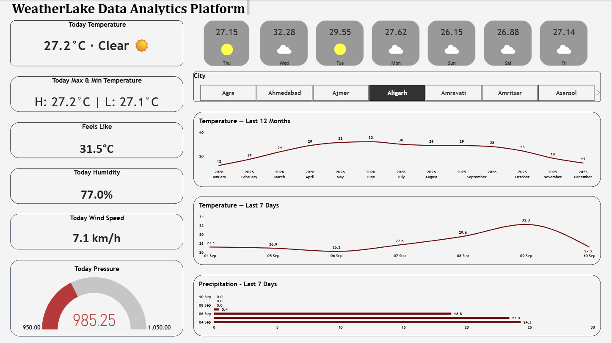

# WeatherLake Data Analytics Platform

[](https://www.python.org/)
[](https://airflow.apache.org/)
[](https://www.docker.com/)
[](https://www.postgresql.org/)
[](https://parquet.apache.org/)
[](https://powerbi.microsoft.com/)
[](https://en.wikipedia.org/wiki/Simple_Mail_Transfer_Protocol)

> An end-to-end weather data engineering platform that ingests historical and real-time weather data, processes it through a Bronze → Silver → Gold architecture, stores analytics-ready data in PostgreSQL, and delivers insights through Power BI.

---

## 📌 Project Overview

**WeatherLake Data Analytics Platform** is an end-to-end data engineering project designed to demonstrate how raw weather data can be transformed into reliable, analytics-ready datasets.

The platform uses the **Open-Meteo API** as the primary data source and implements a layered:

**Bronze → Silver → Gold → Analytics**

architecture.

The project supports both:

* **Historical weather data processing**
* **Real-time weather data ingestion**
* **Automated pipeline monitoring and email notifications**

Apache Airflow orchestrates the pipelines, Apache Parquet is used for the Silver data layer, PostgreSQL provides the Gold analytical layer, and Power BI is used for visualization and analytics.

---

## 🏗️ Architecture

```text
                         ┌──────────────────────┐
                         │    Open-Meteo API    │
                         │  Weather Data Source │
                         └──────────┬───────────┘
                                    │
                                    ▼
                    ┌──────────────────────────────┐
                    │          BRONZE              │
                    │                              │
                    │       Raw JSON Data          │
                    │   Original API Responses     │
                    └──────────────┬───────────────┘
                                   │
                                   │ Airflow
                                   ▼
                    ┌──────────────────────────────┐
                    │          SILVER              │
                    │                              │
                    │ Cleaned & Validated Data     │
                    │       Apache Parquet         │
                    └──────────────┬───────────────┘
                                   │
                                   │ Transformation
                                   ▼
                    ┌──────────────────────────────┐
                    │           GOLD               │
                    │                              │
                    │     PostgreSQL Database      │
                    │      Star Schema Model       │
                    │                              │
                    │  ┌────────┐    ┌──────────┐ │
                    │  │  DIM   │    │   FACT   │ │
                    │  │Location│───▶│ Weather  │ │
                    │  └────────┘    └──────────┘ │
                    └──────────────┬───────────────┘
                                   │
                                   ▼
                    ┌──────────────────────────────┐
                    │          POWER BI             │
                    │                              │
                    │     Analytics Dashboard      │
                    │  Trends • KPIs • Geography  │
                    └──────────────────────────────┘
```

### Operational Monitoring

```text
                     ┌──────────────────┐
                     │   Apache Airflow │
                     │      DAG Run     │
                     └────────┬─────────┘
                              │
                    ┌─────────┴─────────┐
                    │                   │
                    ▼                   ▼
              ┌───────────┐       ┌───────────┐
              │  SUCCESS  │       │  FAILURE  │
              └─────┬─────┘       └─────┬─────┘
                    │                   │
                    └─────────┬─────────┘
                              ▼
                       ┌─────────────┐
                       │    SMTP     │
                       │    Server   │
                       └──────┬──────┘
                              │
                              ▼
                       ┌─────────────┐
                       │    Email    │
                       │ Notification│
                       └─────────────┘
```

---

## 🔄 Data Pipeline

### 1. Data Ingestion

Weather data is retrieved from the **Open-Meteo Historical Weather API** for major cities across India.

The pipeline collects weather variables such as:

* Temperature
* Relative humidity
* Precipitation
* Wind speed
* Wind direction
* Weather code
* Other available meteorological measurements

The project also includes a separate real-time pipeline for periodically retrieving current weather conditions.

---

### 2. Bronze Layer

The Bronze layer stores the **raw API responses** without applying significant transformations.

**Purpose:**

* Preserve the original source data
* Provide traceability
* Support reprocessing
* Maintain a raw historical record

**Format:**

```text
JSON
```

---

### 3. Silver Layer

The Silver layer transforms the raw data into a clean and structured format.

Key processing activities include:

* Data type conversion
* Data cleaning
* Missing-value handling
* Validation
* Timestamp standardization
* Transformation of weather measurements
* Location data normalization

The Silver layer uses:

```text
Apache Parquet
```

Parquet provides a columnar, compressed format suitable for analytical workloads.

---

### 4. Gold Layer

The Gold layer contains analytics-ready data stored in PostgreSQL.

The database follows a **star schema** approach, separating descriptive location information from weather measurements.

Example structure:

```text
                 ┌─────────────────┐
                 │  dim_location   │
                 │─────────────────│
                 │ location_id     │
                 │ city            │
                 │ district        │
                 │ state           │
                 │ latitude        │
                 │ longitude       │
                 └────────┬────────┘
                          │
                          │ location_id
                          │
                          ▼
                 ┌─────────────────────┐
                 │ fact_weather_hourly │
                 │─────────────────────│
                 │ location_id         │
                 │ timestamp           │
                 │ temperature         │
                 │ humidity            │
                 │ precipitation       │
                 │ wind_speed          │
                 │ weather_code        │
                 └─────────────────────┘
```

This structure makes the data easier to query and consume from analytical tools.

---

## ⚙️ Orchestration with Apache Airflow

Apache Airflow is used to orchestrate and automate the data pipelines.

The project contains separate DAGs for historical and real-time processing.

### Historical Pipeline

```text
WeatherLakeDataPlatform.py
```

Responsible for:

* Fetching historical weather data
* Creating Bronze raw data
* Processing Silver Parquet files
* Loading and transforming data into Gold
* Supporting the historical weather dataset

### Real-Time Pipeline

```text
WeatherLakeRealtime.py
```

Responsible for:

* Periodically fetching current weather conditions
* Storing raw real-time data in Bronze
* Processing real-time data into Silver Parquet
* Updating the Gold weather dataset

---

## 📧 Automated Email Notifications

The WeatherLake platform includes **SMTP-based email notifications** integrated with Apache Airflow for pipeline monitoring and operational alerting.

Email notifications help identify pipeline execution results without requiring continuous monitoring of the Airflow interface.

### Notification Events

The pipeline is configured to provide notifications for:

* ✅ Successful pipeline execution
* ❌ Pipeline failure
* ⚠️ Pipeline errors requiring attention

The notification workflow is:

```text
Airflow DAG
     │
     ├── Successful Run ──► SMTP ──► Email Notification
     │
     └── Failed Run ──────► SMTP ──► Email Notification
```

### SMTP Configuration

The project uses Airflow's SMTP configuration to send automated email alerts.

SMTP configuration is handled through the Airflow environment and is **not intended to expose credentials in the Git repository**.

Sensitive information such as:

* Email addresses
* SMTP passwords
* Application passwords
* Authentication secrets

should be configured locally and excluded from version control.

This provides a basic operational monitoring layer for the data pipelines.

---

## 🗂️ Data Coverage

The historical pipeline is designed around major metropolitan and urban locations across India.

Current project configuration includes:

* **100 Indian cities**
* Historical period beginning **January 1, 2020**
* Historical data through **August 31, 2026**
* Real-time weather updates through the dedicated real-time DAG

The city configuration is maintained in:

```text
config/cities.csv
```

This makes the list of locations configurable without modifying the pipeline code.

---

## 🧹 Data Quality & Transformation

The pipeline applies data-cleaning and standardization rules before data reaches the analytical layer.

Examples include:

* Removing unnecessary Unicode accent/diacritic marks from location names
* Standardizing city, district, and state names
* Converting timestamps into consistent formats
* Validating weather measurements
* Handling missing or invalid records
* Maintaining consistent location identifiers

This ensures that the Gold layer provides cleaner and more reliable data for analytics.

---

## 📊 Dashboard Preview

The final Gold-layer data is connected to a **Power BI dashboard** for analytical reporting.

The dashboard is designed to support analysis of:

* Weather trends
* Temperature patterns
* Precipitation
* Humidity
* Wind conditions
* City-level comparisons
* Geographic weather patterns
* Historical and recent weather conditions

### Power BI Dashboard



---

## 🛠️ Technology Stack

| Category         | Technology           |
| ---------------- | -------------------- |
| Programming      | Python               |
| API              | Open-Meteo           |
| Orchestration    | Apache Airflow 3.3.1 |
| Containerization | Docker               |
| Notifications    | SMTP / Email         |
| Raw Data         | JSON                 |
| Silver Storage   | Apache Parquet       |
| Gold Database    | PostgreSQL 16        |
| Data Modeling    | Star Schema          |
| Analytics        | Power BI             |
| Version Control  | Git & GitHub         |

---

## 📁 Repository Structure

```text
WeatherLake Data Analytics Platform/
│
├── README.md
├── .gitignore
├── docker-compose.yml
├── requirements.txt
│
├── config/
│   └── cities.csv
│
├── dags/
│   ├── WeatherLakeDataPlatform.py
│   └── WeatherLakeRealtime.py
│
├── Dashboard/
│   └── WeatherLake Data Analytics Platform.pbit
│
├── docs/
│   └── images/
│       └── weatherlake-dashboard.png
│
├── data/
│   ├── bronze/
│   ├── silver/
│   └── gold/
│
└── sql/
    ├── bronze/
    ├── silver/
    └── gold/
```

> Generated data files are excluded from Git version control. The `data` directories are maintained locally for pipeline execution.

---

## 🚀 Getting Started

### Prerequisites

Before running the project, make sure the following are installed:

* Docker Desktop
* Git
* PowerShell
* A web browser
* Power BI Desktop for dashboard development

---

### 1. Clone the Repository

```powershell
git clone https://github.com/alignasirkhan/Data-Engineering-Projects.git
```

Navigate to the WeatherLake project:

```powershell
cd "Data-Engineering-Projects\WeatherLake Data Analytics Platform"
```

---

### 2. Start the Airflow Environment

Run:

```powershell
docker compose up -d
```

Check running containers:

```powershell
docker compose ps
```

---

### 3. Access Airflow

The Airflow web interface is available locally at:

```text
http://localhost:8080
```

---

### 4. Configure SMTP Notifications

Before using email notifications, configure the required SMTP settings in the local Airflow environment.

Do not commit SMTP passwords, application passwords, or other authentication credentials to GitHub.

---

### 5. Run the Pipeline

The Airflow DAGs can be triggered from the Airflow web interface.

**Historical processing:**

```text
WeatherLakeDataPlatform
```

**Real-time processing:**

```text
WeatherLakeRealtime
```

---

## 📈 Analytics Workflow

The complete analytical workflow can be summarized as:

```text
Open-Meteo API
      ↓
Data Ingestion
      ↓
Bronze / Raw JSON
      ↓
Cleaning & Validation
      ↓
Silver / Parquet
      ↓
Transformation
      ↓
Gold / PostgreSQL
      ↓
Power BI
      ↓
Analytics & Insights
```

Operational monitoring runs alongside the pipeline:

```text
Airflow
   ↓
DAG Execution
   ↓
Success / Failure
   ↓
SMTP
   ↓
Email Notification
```

---

## 🎯 Key Engineering Concepts Demonstrated

This project demonstrates practical implementation of:

* End-to-end ETL/ELT pipeline development
* Data ingestion from REST APIs
* Workflow orchestration with Apache Airflow
* Docker-based development environments
* Bronze–Silver–Gold data architecture
* Data cleaning and transformation
* Apache Parquet for analytical storage
* PostgreSQL data modeling
* Star schema design
* Historical data processing
* Real-time data ingestion
* Data quality practices
* Config-driven pipeline design
* Automated pipeline success and failure notifications
* SMTP-based operational alerting
* Business intelligence and dashboard development
* Git-based version control

---

## 🔮 Future Improvements

Potential improvements to the platform include:

* Cloud-based object storage
* Distributed data processing
* Automated data-quality monitoring
* Additional weather analytics
* Advanced forecasting
* Pipeline observability
* CI/CD automation
* Cloud deployment

---

## 👨‍💻 Author

**Nasir Khan**

Data Engineering | Data Analytics | Cloud & Big Data

---

⭐ If you find this project useful or interesting, consider giving the repository a star.
